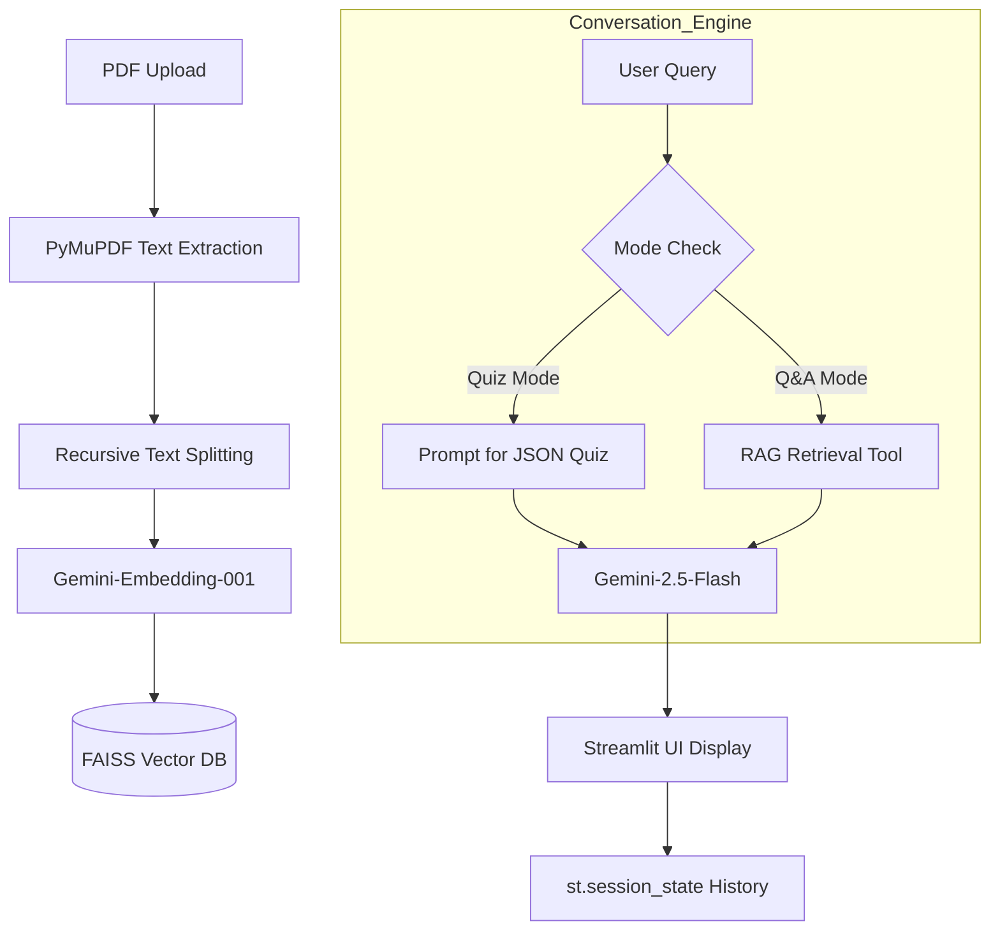

# 🏛️ Architecture Overview

이 문서는 LangChain Quiz Chatbot의 전체 시스템 구조와 데이터 흐름을 대변합니다.

## 🔄 System Workflow (Mermaid Diagram)

## 📂 Core Components
- **Frontend**: Streamlit 기반 웹 인터페이스
- **Orchestration**: LangChain (LCEL) 기반의 RAG 파이프라인
- **AI Models**: 
  - LLM: `gemini-2.5-flash`
  - Embedding: `gemini-embedding-001`
- **Data Store**: 로컬 FAISS 인덱스 (`faiss_index_pdf_quiz/`)

## 🛠️ Module Structure
- `main.py`: 앱 진입점 및 환경 실행 래퍼.
- `src/quiz_chatbot.py`: 핵심 비즈니스 로직(PDF 처리, 퀴즈 생성, 검색 에이전트).
- `.agents/skills/`: 에이전트 전문 역량 라이브러리.
- `.agents/knowledge/`: 프로젝트 핵심 규격 및 정격 지식.

---
*최종 업데이트: 2026-04-12*
