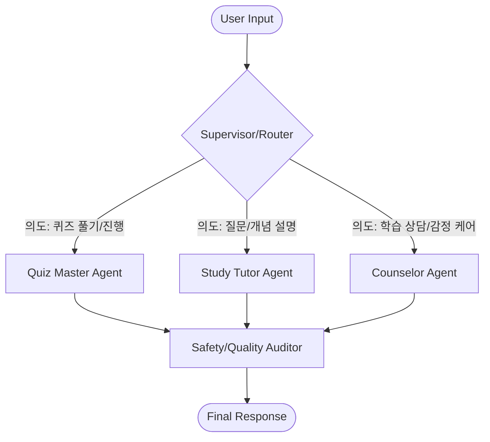

# 🚀 Multi-Agent Architecture Shift Plan

이 문서는 기존 단일 에이전트 기반의 퀴즈 챗봇을 **LangGraph 기반의 멀티 에이전트 시스템**으로 고도화하기 위한 로드맵을 정의합니다.

## 🎯 1. 목표 (Objectives)
- **전문성 강화**: 퀴즈 출제, 개념 설명 등 각 기능에 특화된 페르소나 부여.
- **최적의 오케스트레이션**: 사용자의 의도를 정밀하게 분석하여 적절한 에이전트에게 할당.
- **유지보수성 향상**: 도메인별 로직(퀴즈, RAG, 보안)을 독립된 에이전트 단위로 분리.
- **포트폴리오 가치 극대화**: 최신 AI 아키텍처인 Multi-agent Workflow 및 LangGraph 활용 사례 구축.

## 🏗️ 2. 신규 아키텍처 설계 (Target Architecture)

### 📊 Agent Workflow (Mermaid)

### 🤖 에이전트별 역할 (Agent Roles)
| 에이전트명 | 페르소나 및 기능 | 주요 도구 |
| :--- | :--- | :--- |
| **Supervisor/Router** | 사용자 의도 분류 및 적절한 에이전트로 라우팅 | Intent Classifier |
| **Quiz Master** | 문서 기반 퀴즈 생성, 채점, 오답 분석 및 단계별 힌트 제공 | Quiz Gen Chain |
| **Study Tutor** | RAG 기반 심화 설명, 질문 답변, 학습 보조 | PDF Search Tool |
| **Counselor** | 학습 동기 부여, 위기 감지 및 상담 이관 (기존 가드레일 통합) | Empathy Prompt |
| **Safety Auditor** | 최종 응답의 교육적 적절성 및 정답 유출 여부 검증 | Response Verifier |

## 🛠️ 3. 주요 기술적 변경 사항
1.  **LangGraph 도입**: 에이전트 간의 상태(State) 공유 및 순환 그래프 구조 설계.
2.  **모듈 구조 개편**:
    - `src/agents/`: 개별 에이전트 정의 (router, quiz_master, tutor, auditor).
    - `src/state.py`: 그래프 내에서 공유될 전역 상태 정의.
    - `src/graph.py`: LangGraph 노드 및 엣지 연결 설정.
3.  **가드레일 통합**: 기존 `guardrails.py`의 미들웨어 로직을 `Counselor` 및 `Auditor` 노드로 모델링.

## 📅 4. 구현 로드맵 (Roadmap)

### Phase 1: 파운데이션 구축 (Infrastructure)
- [x] `langgraph` 라이브러리 추가 및 의존성 업데이트 (`uv add langgraph`)
- [x] 멀티 에이전트용 폴더 구조 생성
- [x] 기본 `State` 클래스 정의 (`src/schema.py`)

### Phase 2: 전문 에이전트 개발 (Agent Development)
- [x] **Router Node**: LLM 기반 의도 분류 로직 구현
- [x] **Quiz Master Node**: 기존 퀴즈 생성 로직 고도화 및 전환
- [x] **Study Tutor Node**: RAG 기반 검색 엔진 구현
- [x] **Counselor Node**: 가드레일 및 감성 상담 통합

### Phase 3: 오케스트레이션 및 검증 (Integration)
- [x] **Auditor Node**: 최종 출력 검증 로직 구현
- [x] 전체 그래프(Compiled Graph) 빌드 및 테스트
- [x] `Streamlit` UI와 LangGraph 연동 (세션 상태 유지 로직 수정)

### Phase 4: 폴리싱 및 문서화 (Polishing)
- [x] `ARCHITECTURE.md` 업데이트
- [x] 개발 과정 `HISTORY.md` 기록 및 최종 시나리오 테스트

### Phase 5: 최적화 및 고도화 (Optimization)
- [x] **숫자 답변 라우팅 최적화**: 퀴즈 진행 중 숫자가 입력되면 Router를 거치지 않고 `Quiz Master`로 즉시 연결되도록 규칙 로직 통합.
- [x] **오답 노트 기반 티칭**: `Study Tutor`가 오답 데이터를 문맥에 포함하여 답변하도록 강화하고, `Quiz Master`가 오답 시 학습 전환을 유도함.

### Phase 6: 멀티모달 확장 및 배포 준비 (Deployment & Multimodal)
- [x] **멀티모달 퀴즈 엔진**: 이미지(PNG, JPG) 업로드 및 분석 기능을 통한 시각 자료 기반 퀴즈 생성 로직 구현.
- [ ] **Streamlit Cloud 배포**: 가상 환경 설정 및 Secret Key 관리 최적화.
- [ ] **사용자 경험 테스트**: 실제 학습 시나리오에서의 에이전트 전환 자연스러움 검증.

## ✅ 5. 성공 기준 (Success Criteria)
- 사용자의 모드 변경(퀴즈 vs 질문)이 명시적인 버튼 없이도 자연스러운 대화로 전환됨.
- 에이전트 교체 시 이전 대화 맥락이 유지됨.
- 정답 유출 방지 및 교육용 어투가 모든 응답에서 유지됨.

---
> [!IMPORTANT]
> 이 계획은 개발 중 발견되는 기술적 제약 사항에 따라 유연하게 수정될 수 있습니다. 
> 모든 단계는 `uv`를 통해 수행하며, 매 단계 완료 시 `HISTORY.md`에 기록합니다.
