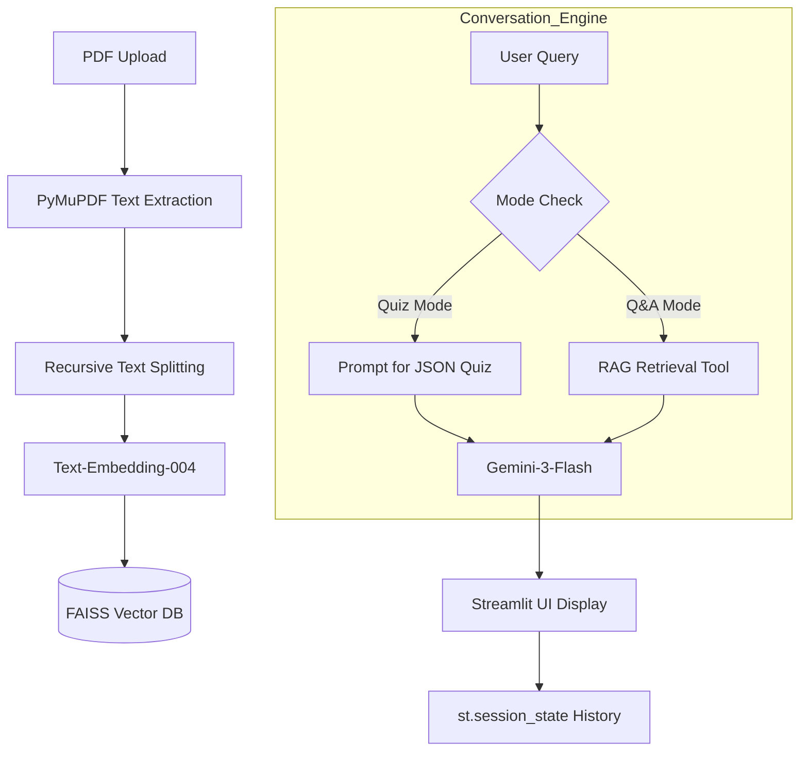

# 📖 LangChain Quiz Chatbot

> **PDF 문서를 분석하여 자동으로 학습 퀴즈를 생성하고 AI와 대화하며 학습하는 똑똑한 러닝 파트너**

[](https://www.python.org/downloads/)
[](https://python.langchain.com/)
[](https://deepmind.google/technologies/gemini/)
[](https://github.com/astral-sh/uv)

---

## 🎯 1. 문제 정의 및 목표 (Problem Definition)

### 개발 동기
방대한 분량의 학습 자료(PDF)를 접할 때, 핵심 내용을 파악하고 스스로 학습 성취도를 확인하는 과정은 많은 시간과 노력이 필요합니다. **"읽기만 하는 학습에서 능동적으로 인출하는 학습으로"** 전환하기 위해, 인공지능이 문서를 분석하고 즉석에서 문제를 만들어주는 서비스를 기획했습니다.

### 타겟 페르소나
- 전공 서적이나 논문을 효율적으로 공부하고 싶은 대학생 및 연구원
- 사내 교육 자료를 빠르게 습득해야 하는 직장인
- 자격증 시험 등 고밀도 텍스트 기반 학습이 필요한 수험생

### 핵심 가치 (Value Proposition)
- **시간 절약**: 수동으로 퀴즈를 만들 필요 없이 AI가 수 초 내에 생성.
- **학습 정착**: 퀴즈를 통한 인출 연습(Retrieval Practice)으로 기억력 향상.
- **근거 기반 답변**: 챗봇의 모든 답변은 업로드된 문서의 구체적인 맥락(RAG)에 기반함.

---

## ✨ 2. 주요 기능 (Key Features)

- **📄 스마트 PDF 분석**: `PyMuPDF`를 사용하여 복잡한 레이아웃의 PDF에서도 고품질 텍스트를 추출하며, `RecursiveCharacterTextSplitter`를 통해 맥락을 유지하며 청크를 분할합니다.
- **📝 자동 퀴즈 생성 (JSON-Structured)**: Gemini 3 Flash의 구조화 출력을 활용하여 4지선다 문제, 보기, 정답, 해설을 포함한 JSON을 생성하고 파싱합니다.
- **🤖 RAG 기반 지능형 채팅**: 사용자가 질문하면 FAISS 벡터 저장소에서 관련 문장을 검색하여 근거 있는 답변을 제공합니다.
- **❌ 오답 노트 및 진행 관리**: 틀린 문제를 추적하여 사이드바에 표시하고, 사용자가 다시 복습할 수 있는 환경을 제공합니다.

---

## 🏛️ 3. 시스템 아키텍처 (Architecture)



---

## 🛠️ 4. 기술 스택 및 선택 이유 (Tech Stack & Rationale)

- **Language**: `Python 3.12+` (최신 언어 기능 및 타입 힌트 활용)
- **Package Manager**: `uv` (pip 대비 압도적인 설치 속도와 예측 가능한 가상환경 관리)
- **LLM**: `Gemini 3 Flash` (멀티모달 이해력과 빠른 응답 속도, 합리적인 API 비용)
- **Embedding**: `Text-Embedding-004` (Gemini 생태계 최적화 및 768차원의 고성능 검색)
- **Vector DB**: `FAISS` (경량화된 로컬 인덱싱으로 서버 리소스 최소화)
- **Framework**: `LangChain (LCEL)` (체인 구조를 통한 유연한 프롬프트 파이프라인 설계)

---

## 💻 5. 핵심 구현 상세 (Key Implementation)

### 🧩 구조화된 출력 (Structured Output Parsing)
프로그램이 안정적으로 동작하기 위해 LLM 응답을 정규표현식과 `json.loads`를 조합하여 파싱합니다.
```python
def parse_ai_json(ai_response):
    json_match = re.search(r'\{.*\}', ai_response, re.DOTALL)
    if json_match:
        return json.loads(json_match.group(0))
    return None
```

### 🧠 프롬프트 엔지니어링
고품질 퀴즈 생성을 위해 시스템 프롬프트에 입출력 제약을 명확히 정의했습니다.
- **Role**: 교육 전문가 (Education Professional)
- **Format**: 4지선다 객관식 JSON 전용 응답
- **Constraint**: 제공된 텍스트 컨텍스트 내에서만 문제 생성

---

## 🚀 6. 시작하기 (Getting Started)

### 환경 변수 설정
`.env` 파일을 생성하고 Gemini API 키를 입력합니다.
```env
GOOGLE_API_KEY=your_gemini_api_key_here
```

### 의존성 설치 및 실행
```bash
# uv를 사용한 초고속 실행
uv run main.py
```

---

## 📈 7. 과정 기반 성찰 (Self-Reflection)

### ✅ 도전 과제 및 해결 (Troubleshooting)
1. **모델 호환성 이슈**: `gemini-2.5-flash-lite`에서 `gemini-3-flash`로 업그레이드 시 임베딩 벡터 차원이 맞지 않는 문제 발생 → 로컬 FAISS 인덱스 자동 갱신 및 에러 안내 로직 추가.
2. **비동기성 관리**: Streamlit의 세션 상태와 AI 에이전트의 충돌 방지를 위해 `st.cache_resource`와 세션 관리를 철저히 분리함.

### 🚀 향후 고도화 로직
- [ ] **RAG 고도화**: Multi-Query Retrieval 적용을 통한 검색 성능 향상.
- [ ] **LangGraph 통합**: 더 복잡한 에이전트 상태(State) 관리 도입.
- [ ] **멀티모달 확장**: PDF 내 이미지를 분석하여 이미지가 포함된 퀴즈 생성.

---

## 👤 연락처 및 기록
- **저자**: [Your Name/Github ID]
- **개발 기록**: [HISTORY.md](./HISTORY.md)
- **아키텍처 가이드**: [ARCHITECTURE.md](./ARCHITECTURE.md)
- **포트폴리오 체크리스트**: [PORTFOLIO_CHECKLIST.md](./PORTFOLIO_CHECKLIST.md)

---
*최종 업데이트: 2026-04-12*
